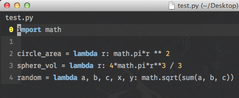
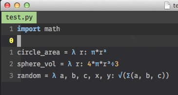

Make use of vim's "conceal" feature to replace certain language keywords with unicode characters. Just for pure eyecandy. This does not replace your source code at any point.

Use of a plugin manager like [Pathogen](https://github.com/tpope/vim-pathogen), [Vundle](https://github.com/gmarik/Vundle.vim) or [NeoBundle](https://github.com/shougo/neobundle.vim) is recommeded for installation. Or you can just simply copy the repesctive syntax file (e.g. `python.vim`) in `~/.vim/after/syntax` folder.

Plugin is inspired by <http://github.com/Twinside/vim-haskellConceal>

